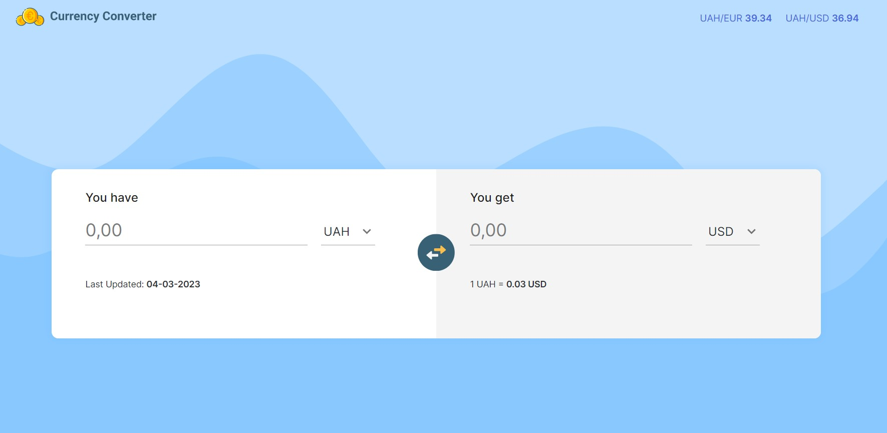

# CurrencyConverter Application

;

This is a currency converting application that allowes users to
convert UAH to such currencies as USD and EUR

## Running the application

After cloning the repository, resolve all dependencies with
`npm install`.

Run `ng serve` for a dev server. Navigate to `http://localhost:4200/`.
The application will automatically reload if you change any of the source files.

## Functionality Overview

The application is an online currency converter, which gets the latest
official UAH exchange rates against foreign currencies (e.g. USD, EUR) from
external API (`https://app.currencyapi.com/`). The application allowes
users to select currency, enter the amount of money to convert and swap the currencies.

### General functionality

- View latest UAH exchange rates against USD, EUR
- Select base and target currency
- Type in amount of money to convert
- Swap currencies an see the updated target amount

## Building the project

Run `ng build` to build the project. The build artifacts will
be stored in the `dist/` directory.

## Running unit tests

Run `ng test` to execute the unit tests via [Karma](https://karma-runner.github.io).
